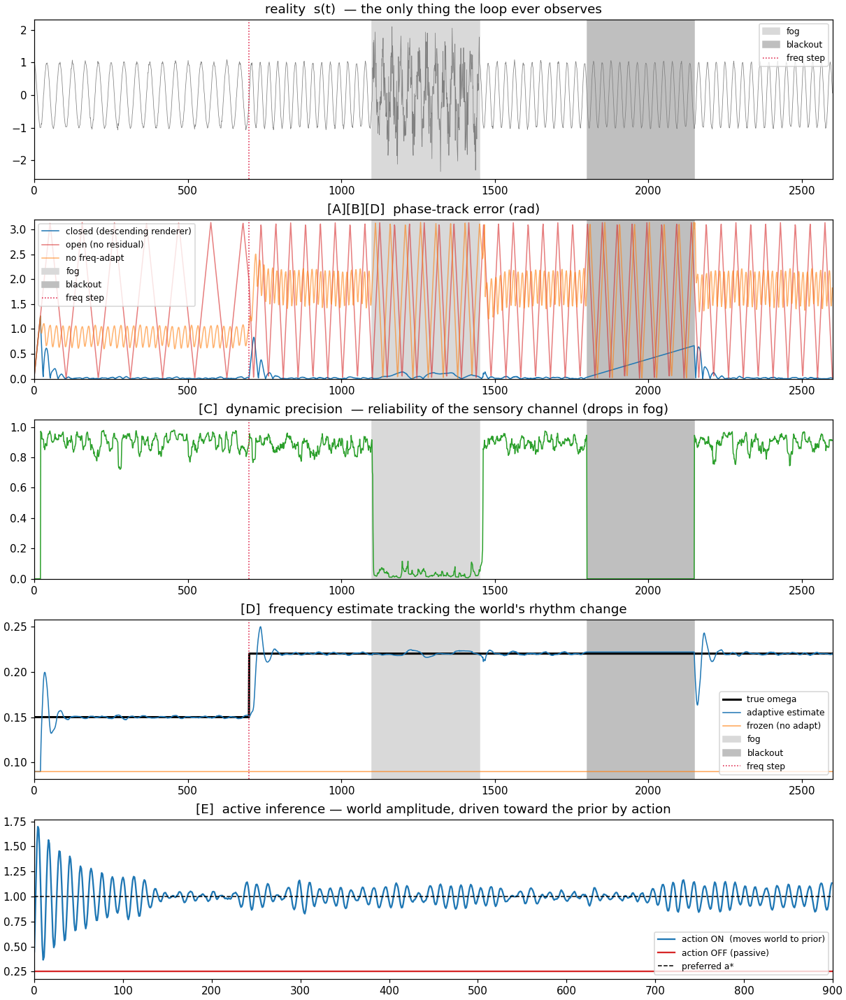

# Alavirta — the descending stream that closes the predictive loop

*(Finnish: **downstream**. The top-down prediction flows down to meet the upstream
sensory flow. The child of [CorticalLoop](https://github.com/anttiluode/CorticalLoop).)*

**PerceptionLab / Antti Luode (Helsinki), with Claude (Opus 4.8). July 2026.**

> **Do not hype. Do not lie. Just show.**

---

## 0. The one edge this adds

CorticalLoop already dead-reckons through a sensory blackout. It has the metric
anchor (grid) and the comparator (CA1 theta gate). The skeleton against drift was
never the missing thing.

What was missing is the wire that lets a top-down state and a bottom-up sensory
stream be compared **at all**. Predictive processing is

```
residual = prediction − reality
```

and that subtraction is only *defined* if both terms live in the same basis. But
the recognizer (a Takens delay embedding) speaks **delay space** `v ∈ ℝ^m`, while
the generator holds an abstract **latent** `h`. You cannot subtract a delay vector
from a hidden state. So the residual had nowhere to be computed, and the loop was
three organs that never touched.

Alavirta builds the missing map — the **descending renderer** `g: h → v̂` — that
renders the held state down into the recognizer's own coordinates, and then closes
the loop on it. This is the functional stand-in for the layer-6 feedback projection:
the top-down fibers that outnumber the forward ones ~10:1 are exactly this renderer.
`alavirta.py` is pure numpy, ~250 lines.

## 1. The descending renderer (the missing line)

The internal state is `θ = (φ, ω, log a)` — a phase, a rate, an amplitude. The
renderer produces a *predicted* delay vector in the recognizer's space:

```
v̂_k = a · cos(φ − k·τ·ω),     k = 0 … m−1
```

Now `e = v̂ − v_real` is a real subtraction. The loop inverts that delay-space
residual to a phase error (first-order, `d̂ ≈ −∂_φ‖e‖² / curvature`) and applies a
**precision-weighted, type-II** correction: a phase nudge plus a frequency
integrator that lets the internal rhythm learn the world's. The prior generative
flow `φ ← φ + ω` runs every tick regardless — that is what coasts through a blackout.

**Precision is not a clock.** CorticalLoop gates correction on a fixed theta rhythm.
Here precision is the *reliability of the sensory channel*, estimated from signal
roughness (the RMS second difference — large for noise, negligible for a smooth
oscillation). It is deliberately computed from the signal, **not** from the model's
own error, so an unlocked start cannot suppress its own means of locking. In fog it
falls and the loop coasts on its prior; on clean input it rises and the loop trusts
the world.

## 2. What running it shows (printed by the engine, not assumed)

One 2600-step run of a scalar oscillator: a **frequency step** at t=700
(ω 0.15→0.22), a **fog** band (t=1100–1450, sensory σ ×18), and a **blackout**
(t=1800–2150). Phase-track error is the circular error in radians; chance ≈ 1.57.

```
[A] descending renderer closes the loop
    settled, closed : 0.013      settled, open (no residual) : 1.566   → chance
[B] dead-reckoning through the blackout
    in blackout, closed : 0.349      open : 1.606      re-lock after : 0.122
[C] dynamic precision vs fixed-high gain, IN THE FOG
    dynamic : 0.067      fixed-high : 0.248 (chases the noise)
    (clean after fog: dynamic 0.016 / fixed 0.016 — both fine when the signal is good)
[D] frequency-step tracking (omega error after the step)
    with freq adapt : 0.0008      no adapt : 0.130 (stuck; phase → 1.84, chance)
[E] active inference — the efferent arm (mean surprise |a_obs − a*|)
    action ON : 0.083 (moves the world to fit the prior)      OFF : 0.750
```

- **[A]** Without the renderer there is no residual and the generator free-runs to
  chance. With it, the loop locks two orders of magnitude tighter. This is the whole
  claim: the seam is what closes the loop.
- **[B]** During the blackout the loop holds its last velocity and coasts. The 0.35
  is honest drift — accumulated velocity error integrated over 350 blind steps — not
  a lock; it re-tightens to 0.12 the moment input returns. The open loop is at chance
  throughout.
- **[C]** Fixed high gain has no way to distrust the fog, so it injects sensory noise
  straight into its state. Dynamic precision down-weights the fog and coasts — 3.7×
  lower error — while giving up nothing on clean data.
- **[D]** The type-II integrator learns the world's new rhythm to 0.0008; frozen ω
  slips 0.07 rad/step and goes to chance. Direction/rate has to be *learned from the
  residual*, not assumed.
- **[E]** The efferent arm: the agent cannot change reality's amplitude by believing
  harder; only the motor can. Error drives the actuator and the world is brought to
  the prior. With action off it is a percept in a jar.



## 3. The biological map (function, not identity)

| component | biology | in `alavirta.py` |
|---|---|---|
| descending renderer `g:θ→v̂` | layer-6 top-down / feedback (~10:1) | `Alavirta.render()` |
| bottom-up recognizer | thalamocortical delay lines | `delay_vector()` (Takens embed) |
| residual in shared space | superficial-pyramidal error units | `e = v̂ − v_real` |
| precision on the error | pulvinar / NMDA gain, attention | `precision()` from signal roughness |
| phase + rate correction | phase precession / speed cells | type-II update on `(φ, ω)` |
| prior generative flow | the cortical oscillator that keeps going | `φ ← φ + ω` (coasts in blackout) |
| action on the world | motor efference / active inference | `active_inference()` |

## 4. Honest ledger

- **[V]** The descending renderer closes the loop. 0.013 vs 1.57 (chance). The
  residual computed in the recognizer's own delay space is sufficient to lock and
  track; the seam is the mechanism.
- **[V]** Dynamic sensory precision beats fixed gain *specifically in the fog* (0.067
  vs 0.248) and ties on clean data. Precision-as-reliability, not precision-as-clock,
  is what buys it.
- **[V]** Type-II frequency adaptation tracks a world-rhythm change (ω-error 0.0008);
  freezing it goes to chance. Rate must be learned from the residual.
- **[V]** Dead-reckoning through the blackout survives on the held prior (0.35 coast
  vs 1.6 open), re-locking to 0.12 — the CorticalLoop result, now in appearance space
  rather than only position.
- **[~]** Precision is estimated by a **proxy** (windowed second-difference
  roughness), not a full generative noise model. It is lock-independent and honest,
  but it is a stand-in.
- **[~]** Active inference is a **minimal one-parameter actuator** (amplitude→prior).
  It demonstrates the efferent principle — error to muscle, not only error to belief —
  but it is not a learned policy over a rich action space.
- **[K]** **The renderer's *form* is not learned.** `g` is an analytic cosine; only
  its parameters `(φ, ω, a)` adapt online. This closes the *inference* and the
  *parameter* half of the plasticity gap, and leaves the *structural* half open: the
  loop does not yet learn the shape of a generator it was not handed. A learned
  decoder net (`h → v̂` from Vino's actual latent) is the next repo, not this one.
- **[B]** "This is a cortex." It is not. It is the seam, demonstrated in miniature,
  on one oscillator, so the mechanism is visible and falsifiable.

## 5. Honest scope (what this is NOT)

- **One scalar oscillator, 1-D.** The real target is the multichannel field; the
  seam carries over, the numbers won't.
- **Stand-in organs.** The generator here is an analytic oscillator (the stand-in for
  [Vino](https://github.com/anttiluode/Vino)); the recognizer is a bare Takens embed
  (the stand-in for [GeometricNeuronV21](https://github.com/anttiluode/GeometricNeuronV21));
  the phase-lock is a first-order inversion where
  [Ristikko](https://github.com/anttiluode/Ristikko)'s homodyne is the proper
  primitive. Alavirta shows the *wire between them works*. Swapping the stand-ins for
  the real organs is the integration this makes buildable — it does not perform it.
- **No claim on consciousness, gravity, or anything upstream.** One edge, closed,
  measured.

## 6. Run it

```bash
pip install numpy matplotlib
python alavirta.py        # prints the scorecard, writes alavirta.png
```
